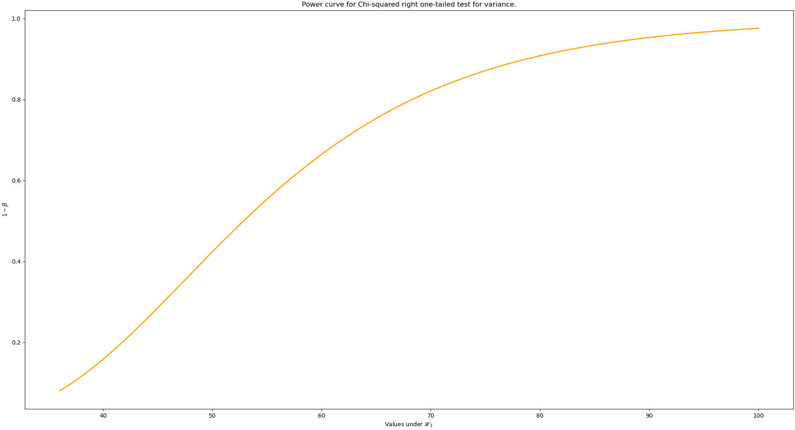

# Hypothesis-Tests


## About

Inspired by R functions, this python package allows you to perform some basic hypothesis tests. Right now there are 6 types of
tests available, they are:

* One sample tests
    * T-student test for true value of mean.
    * Chi-squared test for true value of variance.
    * Z test for true value of proportion.
* Two sample tests
    * T-student test for the difference between two means.
    * F test for the ratio between two variances.
    * Z test for the difference between two proportions.

More tests might be added in the future.

## Installation

Before using this package, you need to make sure to have installed numpy, scipy, matplotlib and prettytable into your system.
You can install them pasting the following command `pip install numpy scipy matplotlib prettytable` into your terminal shell.

After installation of aforementioned requirements, you can install this package following these steps:

1. Inside your terminal, get into the root of your project directory. Normally, you do this with cd command.
2. Use the following command to download the package `git clone https://github.com/al1sant0s/Hypothesis-Tests/ Hypothesis`
3. Finally, import the package to your main python file adding this line `import Hypothesis.hypotest as hypotest` somewhere at the beggining of the file.

Now you are ready to start.

## How it works?

Before getting into practical usage of the tests, some clarification needs to be done.
If you wish, you can skip straight to the usage section and come back here later in case you need more details.

Each test is built from a specific class. Bellow are listed the classes used to perform each test:

* `HypoTstudTest` class performs tests for mean(s) using one or two samples.
* `HypoVarTest` class performs tests for variance(s) using one or two samples.
* `HypoPropTest` class performs tests for proportion(s) using one proportion and one sample size
or two proportions and two sample sizes.

Also there is one special class called Hypotest. `Hypotest` class does not perform any test.
It just serves as the base class used to construct the classes above. **You will never need to interact directly with this class.**

To perform a test, call one of the 3 classes mentioned before and pass the arguments needed for them. The parameters they accept are described bellow.

### Test for mean(s)
Used to perform tests for mean(s) using one or two samples.

```python
HypoTstudTest(self, x, y = None, mu_0 = 0, sig = 0.05, alternative = "bilateral", var_equal = False)
```
Parameteres:
   * **_x:_** the first sample for the test. It can be a list or a numpy array.
   * **_y:_** the second sample for the test. It can be a list or a numpy array.
   * **_mu_0:_** this represents the value under null hypothesis. For one sample tests this is the true mean. For two samples tests
     this is the difference between the means.
   * **_sig:_** the significance level used for this test.
   * **_alternative:_** determines the direction of the test. The values available are the following: "left", "right", "bilateral".
   * **_var_equal:_** indicates whether the two samples are taken from two populations with the same variance (only used for two samples tests).

### Test for variance(s)
Used to perform tests for variance(s) using one or two samples. 
```python
HypoVarTest(self, x, y = None, sigma_sqr0 = 1, sig = 0.05, alternative = "bilateral")
```
Parameteres:
   * **_x:_** the first sample for the test. It can be a list or a numpy array.
   * **_y:_** The second sample for the test. It can be a list or a numpy array.
   * **_sigma_sqr0:_** this represents the value under null hypothesis. For one sample tests this is the true variance. For two samples tests
     this is the ratio between the variances.
   * **_sig:_** the significance level used for this test.
   * **_alternative:_** determines the direction of the test. The values available are the following: "left", "right", "bilateral".
    
### Test for proportion(s)
Used to perform tests for one or two proportions.
```python
HypoPropTest(self, p1, n1, p2 = None, n2 = None, pi0 = 0, sig = 0.05, alternative = "bilateral")
```
Parameteres:
   * **_p1:_** the sample 01 proportion.
   * **_n1:_** the size of the sample 01 which the p1 proportion was taken from.
   * **_p2:_** the sample 02 proportion.
   * **_n2:_** the size of the sample 02 which the p2 proportion was taken from.
   * **_pi0:_** this represents the value under null hypothesis. For one proportion test this is the true value of the proportion in the population.
     For two proportions test this is the value of the difference between the two proportions in the populations.
   * **_sig:_** the significance level used for this test.
   * **_alternative:_** determines the direction of the test. The values available are the following: "left", "right", "bilateral".

## Results
For any of these tests, an object of `Hypotest` class will be returned.
This object will have many attributes and methods. Bellow are listed **only** the most important attributes and methods that might be useful.

### Attributes available for all test objects:

* **_sig:_** significance level of the test.
* **_ts:_** test statistic value of the test.
* **_v0:_** value under null hypothesis.
* **_alternative:_** type of alternative hypothesis being used (left, right or bilateral).
* **_description:_** a short description about the test.
* **_sampling_estimates:_** this will be a dictonary with specific statistic values for the test.
* **_cv:_** a numpy array with one or two critical values of the test.
* **_pvalue:_** the pvalue calculated for the test.
* **_reject:_** a boolean variable that tells if null hypothesis should be rejected (or not).

### Methods available for all test objects:

#### summarize
Assembles information from the test.
```python
summarize(self, show = True, minimal = False, align = "l", border_style = "DOUBLE_BORDER", **kwargs)
```
Parameteres:
* show: if set to True, it will print a table built from prettytable with results.
* minimal: if set to True, it will print less information, otherwise it will print all info available for the test.
  Set this parameter to true if you wish to have different kinds of tests with same standard tables.
* align: this parameter is from `PrettyTable` class and it determines the alignment of the table. You can use 'l' for left, 'c' for centered and 'r' for right alignment.
* border_style: this parameter is from `PrettyTable` class and it determines the border style of the table. Any border style supported by prettytable can be passed as a string.
* **kwargs: additional keyword arguments for `PrettyTable`. You can learn more about prettytable [here](https://pypi.org/project/prettytable/).
   
It returns a numpy array with the results presented in table in the order they appear (from top to bottom).

#### plot_test
It will create a plot of the test.
```python
plot_test(self, show_values = True, fill_pvalue = False, lw = 2, colors = {})`
```
Parameteres:
* show_values: if set to True, it will attempt to show critical values on x axis and the test statistic value inside the curve (it depends on the space available),
  otherwise it will let matplotlib choose the x axis marks (ticks).
* fill_pvalue: if set to True, it will fill the area associated with the pvalue of the test.
* lw: control the linewidth of the lines of the plot.
* colors: this dictonary is used to plot the test with specific colors. Bellow are the keys you can put in this dictonary along with the default colors used.
   * `"pdf": "#8c8c8c"` color of the probability density function (curve).
   * `"ts": "#D2B48C"` color of the dashed line that indicates the test statistic position.
   * `"cr": "#F08080"` color of the critical region.
   * `"pv": "#FFE4C4"` color used to fill pvalue area.
   * `"bl": "#696969"` color of the bottom line.
       
You can use any color supported by matplotlib. For more details, check [this](https://matplotlib.org/stable/users/explain/colors/colors.html).
The keys that you pass will update the colors of the associated components. This means that you don't need to pass all of them, but only the ones you wish to change.

#### power
Computes power of test for a sequence of values.
```python
power(self, v1, show = True, align = 'l', border_style = "DOUBLE_BORDER", **kwargs)
```
Parameteres:  
* v1: a single or sequence of values for power to be computed from. These are all values for the alternative hypothesis.
* show: if set to True, it will print a table built from prettytable with results.
* align: this parameter is from `PrettyTable` class and it determines the alignment of the table. You can use 'l' for left, 'c' for centered and 'r' for right alignment.
* border_style: this parameter is from `PrettyTable` class and it determines the border style of the table. Any border style supported by prettytable can be passed as a string.
* **kwargs: additional keyword arguments for `PrettyTable`. You can learn more about prettytable [here](https://pypi.org/project/prettytable/).
     
It returns a numpy array with the powers calculated for each v1 value.

#### plot_power
It will create a plot of the power (power curve) for a sequence of values.
```python
plot_power(self, v1, lw = 2, color = "#4682B4")
```
Parameteres:
* v1: a single or sequence of values for power to be computed from. These are all values for the alternative hypothesis.
* lw: control the linewidth of the lines of the plot.
* color: specify the color of the curve.
  You can use any color supported by matplotlib. For more details, check [this](https://matplotlib.org/stable/users/explain/colors/colors.html).
  
With all of this out of the way, we can now check some examples of usage.

## Usage

In the examples bellow we will use these samples.
```python
import numpy as np
import Hypothesis.hypotest as hypotest

rng = np.random.default_rng(1)
sample01 = rng.normal(5, 6, 25)
sample02 = rng.normal(4.6, 6, 25)
```

### Test for one mean

Test if the mean of the population 01 where sample01 was taken from is equal to 5 or not,
using 0.05 significance level. We have this test then:

$$
   \begin{cases}
      \mathscr{H}_0: \mu = 5\\
      \mathscr{H}_1: \mu \neq 5
   \end{cases}
$$

Now doing the test.
```python
one_mean_test = hypotest.HypoTstudTest(x = sample01, mu_0 = 5, sig = 0.05, alternative = "bilateral")

print("\n--- Test for one mean done! Results presented bellow. ---\n")
one_mean_test.summarize() # See the results
```

Print a compact table setting minimal to True, using a different border style.
```python
print("\n--- Print the same table with less information and with a different appearance. ---\n")
one_mean_test.summarize(minimal = True, border_style = "SINGLE_BORDER") # See the results
```
We can choose not to print the table and only get the results instead.
```python
results = one_mean_test.summarize(show = False, minimal = True, border_style = "SINGLE_BORDER") # Get the results

# Check pvalue using both the class attribute and the results (the 6th line of the table is where pvalue appear so we use 5 as index).
print(one_mean_test.pvalue, results[5]) # it should print the same value twice

# Print everything from results.
print(results)
```
Finally, we can visualize the test using matplotlib plots.

```python
one_mean_test.plot_test() # visualize test
```


The result might vary slightly depending on the backend matplotlib is using in your system. It's recommended to maximize the plot window to have a better look at it.

### Test for two means

Test if sample01 and sample02 were taken from 2 populations in which population 02 has a mean greater than the mean of population 01.
Use 0.07 as the significance level. We have this test then:

$$
   \begin{cases}
      \mathscr{H}_0: \mu_1 - \mu_2 = 0\\
      \mathscr{H}_1: \mu_1 - \mu_2 < 0
   \end{cases}
$$

Now doing the test.
```python
# We use var_equal = True because we know the samples were taken from 2 populations with same variance.
two_mean_test = hypotest.HypoTstudTest(x = sample01, y = sample02, mu_0 = 0, sig = 0.07, alternative = "left", var_equal = True)

print("\n--- Test for two means done! Results presented bellow. ---\n")
two_mean_test.summarize() # See the results

two_mean_test.plot_test() # plot the test without showing pvalue area
two_mean_test.plot_test(fill_pvalue = True) # now plot the test showing pvalue area
```


Now we will plot a power curve for this test.
```python
two_mean_test.plot_power(np.linspace(-10,2,100), lw = 5) # plot power curve with a thicker linewidth
```


We can also print a table of power for a few selected values under alternative hypothesis.
```python
powers = two_mean_test.power([-5,-4,-3,-2,-1]) # print power table and get the powers into powers variable

print(powers) # print the powers
```

### Test for one variance

Test if the variance of the population 01 where sample01 was taken from is greater than 36,
using 0.08 significance level. We have this test then:

$$
   \begin{cases}
      \mathscr{H}_0: \sigma^2 = 36\\
      \mathscr{H}_1: \sigma^2 > 36
   \end{cases}
$$

Doing the test now.
```python
one_var_test = hypotest.HypoVarTest(x = sample01, sigma_sqr0 = 36, sig = 0.08, alternative = "right")

print("\n--- Test for one variance done! Results presented bellow. ---\n")
one_var_test.summarize(minimal = True) # See the results

# plot the test using a different color scheme
one_var_test.plot_test(fill_pvalue = True, colors = {"pdf": "#FF1493", "ts": "#D8BFD8", "cr": "#BA55D3", "pv": "#7FFF00", "bl": "#4B0082"}) # with pvalue
one_var_test.plot_test(colors = {"pdf": "#FF1493", "ts": "#D8BFD8", "cr": "#BA55D3", "pv": "#7FFF00", "bl": "#4B0082"}) # without pvalue

one_var_test.plot_power(np.linspace(36, 100, 1000), color = "orange")
```




### Test for two variances

Test if the variances of the population 01 and 02 where sample01 and sample 02 were taken from are equal,
using the default 0.05 significance level. We have this test then:

$$
   \begin{cases}
      \mathscr{H}_0: \frac{\sigma_1^2}{\sigma_2^2} = 1\\
      \mathscr{H}_1: \frac{\sigma_1^2}{\sigma_2^2} \neq 1
   \end{cases}
$$

Doing the test now.
```python
two_var_test = hypotest.HypoVarTest(x = sample01, y = sample02, sigma_sqr0 = 1)

print("\n--- Test for two variances done! Results presented bellow. ---\n")
two_var_test.summarize(minimal = True) # See the results

two_var_test.plot_test(lw = 5) # Plot test
```


### Test for one proportion

Test if proportion of a population is 0.4 knowing that a sample of size 250 with a
sampling proportion of 0.43 was collected. We have this test then:

$$
   \begin{cases}
      \mathscr{H}_0: \pi = 0.4\\
      \mathscr{H}_1: \pi \neq 0.4
   \end{cases}
$$

Doing the test now.
```python
one_prop_test = hypotest.HypoPropTest(p1 = 0.43, n1 = 250, pi0 = 0.4)

print("\n--- Test for one proportion done! Results presented bellow. ---\n")
one_prop_test.summarize() # See the results

one_prop_test.plot_test()
```


### Test for two proportions


Test if proportions of two populations are equal  knowing that a sample of size 250 with a
sampling proportion of 0.43 was collected from the first population and another sample of size 300 with a sampling proportion
of 0.5 was collected from the second population. Use 0.1 as the significance level. We have this test then:

$$
   \begin{cases}
      \mathscr{H}_0: \pi_1 - \pi_2 = 0\\
      \mathscr{H}_1: \pi_1 - \pi_2 \neq 0
   \end{cases}
$$

Doing the test now.
```python
two_prop_test = hypotest.HypoPropTest(p1 = 0.43, n1 = 250, p2 = 0.5, n2 = 300, pi0 = 0, sig = 0.1)

print("\n--- Test for two proportions done! Results presented bellow. ---\n")
two_prop_test.summarize() # See the results

two_prop_test.plot_test()
```


## Conclusion

These are all hypothesis tests available in this package. More features might be added in the future.
